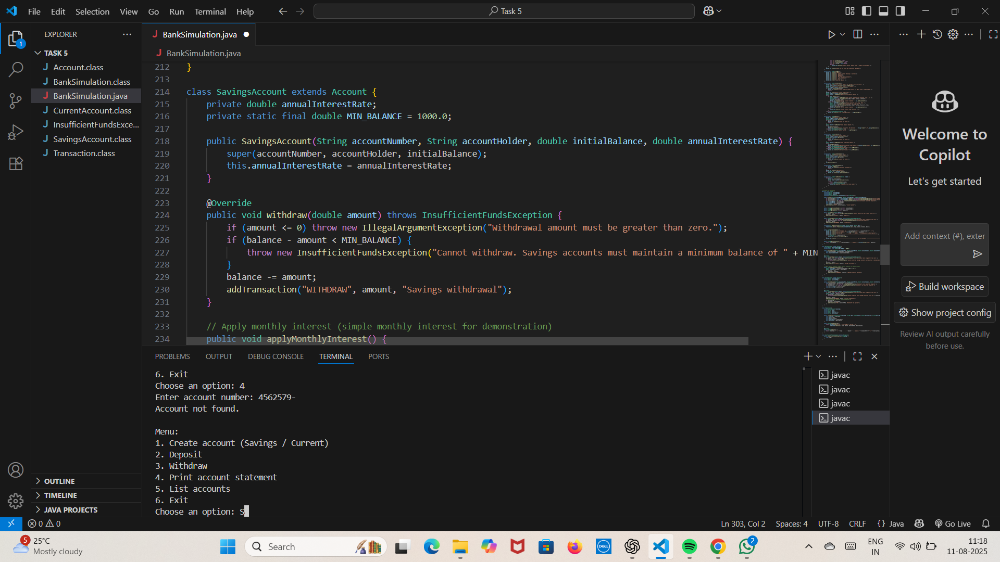

# 💳 Java CLI Notebook

## 📖 Overview
This project is a **Java command-line application** designed to simulate a simple notebook system where users can manage text entries.  
It’s a great starting point for beginners to understand **Java basics** along with **Object-Oriented Programming (OOP)** concepts like classes, objects, methods, and encapsulation.

With this application, you can create new notes, view all saved notes, delete specific notes, and exit the program — all from your terminal.

---

## 🔹 Key Features
- Create and save a new note in the notebook.
- View all saved notes in a clean list format.
- Delete any note by selecting its number.
- Simple menu-driven interface for easy navigation.
- Ensures only valid actions are performed.

---

## 🛠 Tech Stack
- **Java** – Core programming language
- **OOP Concepts** – Classes, Objects, Encapsulation
- **Scanner Class** – For user input
- **VS Code** / IntelliJ IDEA – Preferred editors
- **Command Line / Terminal** – For running the application

---
## 🖼 Screenshot  


---

## 📂 Project Repository
🔗 [Click here to view the repository](https://github.com/pucchalapallieeswaridevi/JavaCLI-Notebook/tree/main)

---

## 👩‍💻 Developed By
**Eeswari Devi**

---

## 🚀 How to Run the Program
1. **Clone the repository**
   ```bash
   git clone https://github.com/pucchalapallieeswaridevi/JavaCLI-Notebook.git

